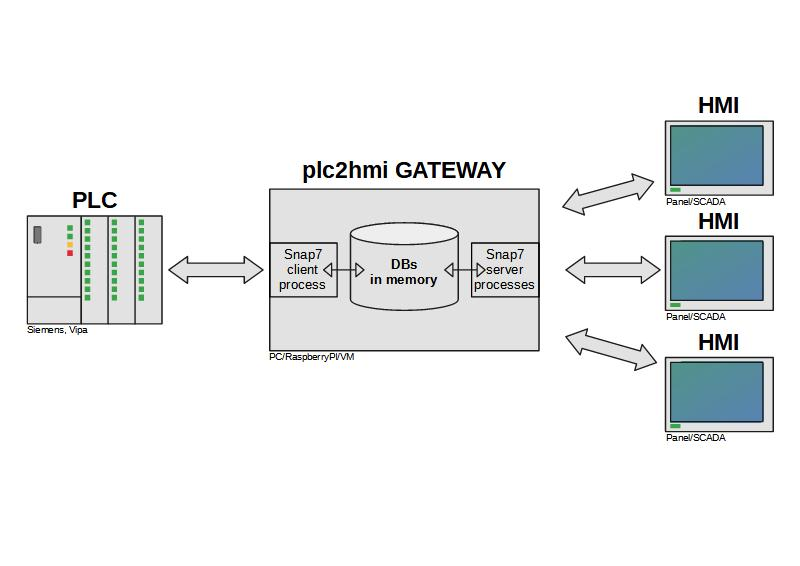

# plc2hmi gateway script

#### About

This is a Snap7 based script for:

- reducing communication load on PLC (Siemens S7-300, S7-1200, S7-1500, Vipa) in the situation with many HMI connection
- restriction access to PLC.HMI can read/write data only into DBs from the list.

#### Requirements

- python 3 (tested on Python 3.7/3.8)
- Snap7 library installed (http://snap7.sourceforge.net/)
- python-snap7 wrapper (https://github.com/gijzelaerr/python-snap7)

#### Main features

- automatically loading selected DBs from PLC into memory

- read DBs data from PLC with a fixed frequency

- write change from HMI immediately 

  

  

#### Known issues

- server part runs one process for every HMI connection. The big quantity of connections and queries/sec can overload the gateway CPU and overheat it (tested on RPi4 with 8 HMI Siemens). Script can't control timings or "answers count"/sec. You can reduce connection speed on the server interface only.
- no error answer when you read /write data from DBs with wrong(bigger) offset. You receive the wrong values.

#### Recomendations

Use in couple with supervisord (http://supervisord.org/).